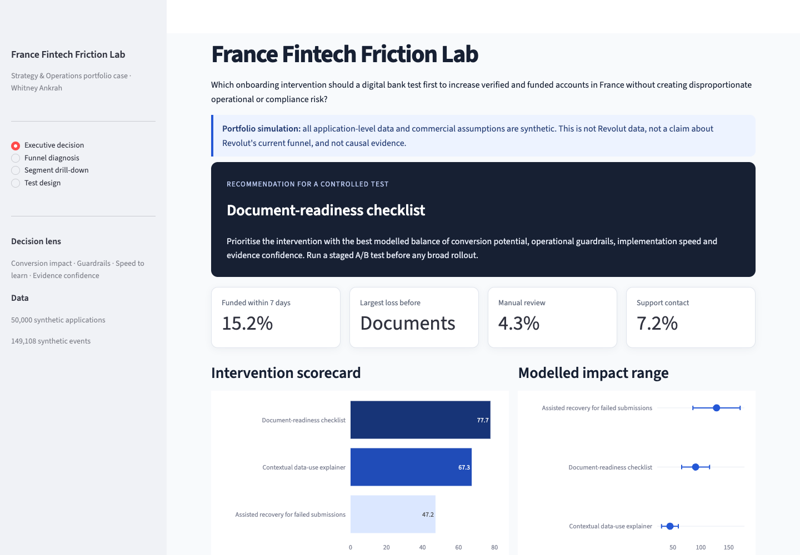

# France Fintech Friction Lab

**A transparent Strategy & Operations case: diagnosing remote-onboarding friction, prioritising one
intervention and designing the test that could prove or disprove it.**

> **Evidence boundary:** Every application, event, conversion rate and commercial assumption in this
> repository is synthetic. This is not Revolut data, not an estimate of Revolut's performance and not
> causal proof. Public sources define the operating context; the model selects what to test next.



## The 60-second decision

**Question:** Which onboarding intervention should a digital bank test first to increase verified and
funded accounts in France without creating disproportionate operational or compliance risk?

**Recommendation:** Test a **document-readiness checklist** before remote verification. In this
scenario it addresses the largest modelled source of avoidable friction while remaining faster to
learn and operationally safer than assisted recovery.

The generated baseline contains **50,000 applications and 149,108 events**. The largest absolute
transition loss is before document submission (13,847 applications). The modelled checklist ranks
first with a 77.7/100 decision score and a mean uplift of 91 funded accounts per 10,000 applications;
the 10th–90th percentile range is 66–116. These figures are scenario outputs, not performance claims.

The checklist wins four of five plausible decision-weight profiles. Under a speed-first profile the
contextual explainer wins, making the dependency on management priorities visible rather than
hard-coding one answer.

**Do not roll it out on the model alone.** Run a controlled experiment sized on the stage the
checklist targets: document submission as the primary metric (12,206 participants, about 37 days
of enrolment at 10,000 applications per month), funded account within seven days as the
directional secondary metric, and verification, manual review, support contact and compliance
indicators as guardrails. The funded rate alone cannot be powered inside one quarter for the
modelled ~0.9 pp lift, which is exactly why the test reads the targeted stage first.

**What would change the decision:** evidence that the checklist increases review queues, a realised
lift below the pre-agreed threshold, customer research showing that the copy reduces trust, or a
compliance requirement that changes the proposed sequence.

## Why this repository exists

The case demonstrates the work of Strategy & Operations rather than a decorative dashboard:

1. define one decision and its constraints;
2. design an auditable event model;
3. diagnose funnel and segment friction with SQL;
4. make uncertain assumptions explicit;
5. compare interventions using impact and guardrails;
6. turn the recommendation into a 90-day operating plan.

## Outputs

| Recruiter path | Artifact |
|---|---|
| Read the recommendation | [`docs/executive_memo.md`](docs/executive_memo.md) |
| Scan the decision logic | [`docs/decision_one_pager.md`](docs/decision_one_pager.md) |
| See the execution plan | [`docs/90_day_plan.md`](docs/90_day_plan.md) |
| Check every public claim | [`docs/claims_register.md`](docs/claims_register.md) |
| Prepare for the interview | [`docs/interview_defence_guide.md`](docs/interview_defence_guide.md) |
| Present the case in three minutes | [`docs/recruiter_walkthrough.md`](docs/recruiter_walkthrough.md) |
| Field the France-specific research | [`docs/french_research_protocol.md`](docs/french_research_protocol.md) |
| Explore the analysis | `streamlit run dashboard/app.py` |
| Audit assumptions | [`config/model_assumptions.yml`](config/model_assumptions.yml) |
| Review evidence boundaries | [`docs/methodology.md`](docs/methodology.md) |
| Inspect SQL | [`sql/`](sql/) |

## Reproduce the case

Python 3.12 is recommended and recorded in `.python-version`. Python 3.14 is intentionally excluded
until the analytics dependency stack supports it consistently.

```bash
python -m venv .venv
source .venv/bin/activate
python -m pip install -e ".[dev]"
make all
make dashboard
```

The pipeline creates 50,000 synthetic applications and their event history, runs DuckDB SQL,
simulates uncertainty around three interventions and writes recruiter-facing artifacts.

Current generated baseline: 15.19% funded within seven days, 4.26% manual review and 7.23% support
contact. Run the pipeline to verify every figure from source code.

## Repository map

```text
assets/                   Committed dashboard screenshot
config/                   Explicit intervention and economic assumptions
dashboard/                Streamlit decision interface
data/processed/           Reproducible synthetic Parquet datasets
artifacts/                Generated metrics and model outputs
docs/                     Decision, methodology, risks and 90-day plan
scripts/                  Pipeline entry points
sql/                      Funnel, segment, weekly KPI and stage-duration analysis
src/friction_lab/         Data generation and decision model
tests/                    Data-contract, analysis and dashboard tests
```

## Technology

Python · pandas · NumPy · DuckDB · SQL · Parquet · Plotly · Streamlit · pytest · Ruff · GitHub Actions

## Candidate

**Whitney Ankrah** — B.Sc. Business Information Systems candidate with experience in banking IT
project management, process analysis, Python automation, entrepreneurship and incoming HR
Digitalisation & Analytics experience at Porsche AG.
